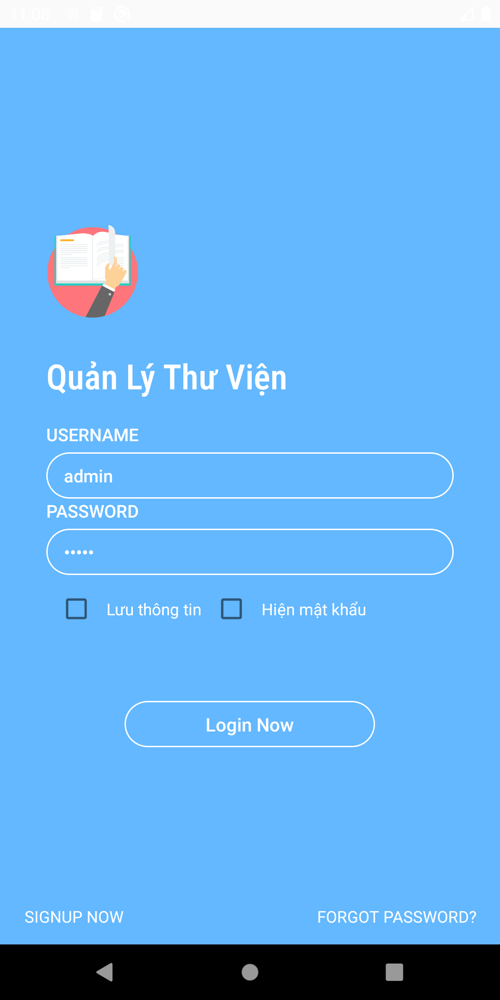
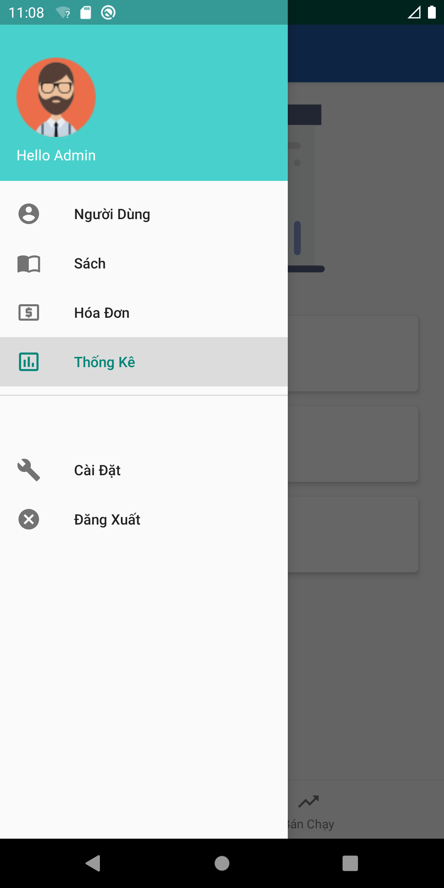

# Pig Librarian

PigKeeper là ứng dụng quản lý chi tiêu cá nhân, chi tiêu gia đình hoặc tập thể với phiên bản đơn giản dễ dùng. Sổ Thu Chi không những giúp bạn ghi lại từng khoản chi tiêu một cách chi tiết mà còn sở hữu những công cụ giúp bạn làm chủ đồng tiền như: đặt ngân sách chi tiêu, quản lý nhiều ví và tài khoản, quản lý tiết kiệm, tiền gửi, v.v...

TÍNH NĂNG:

★ PigKeeper là một ứng dụng quản lý thu chi tốt với giao diện tiếng Việt thân thiện. Bạn có thể dễ dàng theo dõi được tình hình tài chính của mình theo thời gian.

★ Ghi chép thu chi nhanh và tiện lợi: 

★ Ghi lại đã chi/tiêu khoản gì, từ ví/tài khoản nào, vào lúc nào để theo dõi luồng tiền.

★ Theo dõi số tiền vay/nợ để nhắc nhở giúp thanh toán đầy đủ. 

★ Báo cáo theo hạng mục

